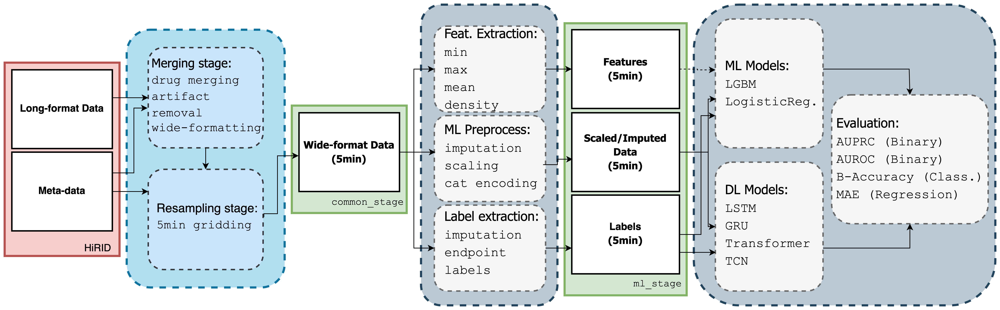

# HiRID-ICU-Benchmark

This repository contains the needed resources to build the HIRID-ICU-Benchmark dataset for which the manuscript can be found [here](https://openreview.net/forum?id=SnC9rUeqiqd).

We first introduce key resources to better understand the structure and specificity of the data.
We then detail the different features of our pipeline and how to use them as shown in the below figure.



## Key Resources
We build our work on previously released data, models, and metrics. To help users which might be unfamiliar with them we provide in this section some related documentation.
### HiRID data
We based our benchmark on a recent dataset in intensive care called HiRID.
It is a freely accessible critical care dataset containing data from more than 33,000 patient admissions to the Department of Intensive Care Medicine, Bern University Hospital, Switzerland (ICU) from January 2008 to June 2016.
It was first released as part of the [circulatory Early Warning Score](https://www.nature.com/articles/s41591-020-0789-4) project. 

First, you can find some more details about the demographics of the patients of the data in **Appendix A: HiRID Dataset Details**. However, for more details about the original data, it's better to refer to its latest [documentation](https://hirid.intensivecare.ai/) .
More in detail the documentation contains the following sections of interest:
- [Getting started](https://hirid.intensivecare.ai/Getting-started-dc773c10ba494af4a94057eb223c2e83) This first section points to a jupyter notebook to familiarize yourself with the data.
- [Data details](https://hirid.intensivecare.ai/Data-details-1ff9c433b9894904b1dbd7652be4b11c) This second section contains a description of the variables existing in the dataset. To complete this section you can refer to our [varref.tsv](preprocessing/resources/varref.tsv) which we use to build the common version of the data.
- [Structure of the published data](https://hirid.intensivecare.ai/Data-details-1ff9c433b9894904b1dbd7652be4b11c) This final section contains details about the structure of the raw data you will have to download and place in `hirid-data-root` folder (see "Run Pre-Processing").

### Models
As for the data, in this benchmark, we compare existing machine learning models that are commonly used for multivariate time-series data.
For these models' implementation we use `pytorch`, for the deep learning models, `lightgbm` for the boosted tree approaches, and `sklearn` for the logistic regression model and metrics. 
In the deep learning models we used the following models: 
- [Long Short-term Memory (LSTM)](https://ieeexplore.ieee.org/document/818041): The most commonly used type of Recurrent Neural Networks for long sequences.
- [Gated Recurrent Unit (GRU)](https://arxiv.org/abs/1406.1078) : A extension to LSTM which showed improvement over them in the context of polyphonic music modeling and speech signal modeling ([paper](https://arxiv.org/abs/1412.3555)).
- [Temporal Convolutional Networks (TCN)](https://arxiv.org/pdf/1803.01271 ): 1D convolution approach to sequence data. By using dilated convolution to extend the receptive field of the network it has shown great performance on long-term dependencies.
- [Transformers](https://papers.nips.cc/paper/2017/file/3f5ee243547dee91fbd053c1c4a845aa-Paper.pdf): The most common Attention based approach.

### Metrics
In our benchmark we use different metrics depending on the tasks, however, all the implementations are from `sklearn` which documents well their usage:
- Binary Classification: Because our tasks are all highly imbalanced, we use both ROC and PR Area Under the Curve using [sklearn.metrics.roc_auc_score](https://scikit-learn.org/stable/modules/generated/sklearn.metrics.roc_auc_score.html) and [sklearn.metrics.average_precision_score](https://scikit-learn.org/stable/modules/generated/sklearn.metrics.average_precision_score.html#sklearn.metrics.average_precision_score)
- Multiclass Classification: As here also the `Phenotyping` task is imbalanced, we compare model with [Balanced Accuracy](https://ong-home.my/papers/brodersen10post-balacc.pdf) using [sklearn.metrics.balanced_accuracy_score](https://scikit-learn.org/stable/modules/generated/sklearn.metrics.balanced_accuracy_score.html#sklearn-metrics-balanced-accuracy-score)
- Regression : For regression we prefer the Mean Absolute Error (MAE) as our metric of choice with [sklearn.metrics.mean_absolute_error](https://scikit-learn.org/stable/modules/generated/sklearn.metrics.mean_absolute_error.html)
## Setup

In the following we assume a Linux installation, however, other platforms may also work

1. Install Conda, see the [official installation instructions](https://docs.conda.io/projects/conda/en/latest/user-guide/install/index.html)
2. clone this repository and change into the directory of the repository
3. `conda env update` (creates an environment `icu-benchmark`)
4. `pip install -e .`

## Download Data

1. Get access to the HiRID 1.1.1 dataset on [physionet](https://physionet.org/content/hirid/1.1.1/). This entails
   1. getting a [credentialed physionet account](https://physionet.org/settings/credentialing/)
   2. [submit a usage request](https://physionet.org/request-access/hirid/1.1.1/) to the data depositor
2. Once access is granted, download the following files
   1. [reference_data.tar.gz](https://physionet.org/content/hirid/1.1.1/reference_data.tar.gz)
   2. [observation_tables_parquet.tar.gz](https://physionet.org/content/hirid/1.1.1/raw_stage/observation_tables_parquet.tar.gz)
   3. [pharma_records_parquet.tar.gz](https://physionet.org/content/hirid/1.1.1/raw_stage/pharma_records_parquet.tar.gz)
3. unpack the files into the same directory using e.g. `cat *.tar.gz | tar zxvf - -i`


## How to Run

### Run Prepocessing

Activate the conda environment using `conda activate icu-benchmark`. Then

```
icu-benchmarks preprocess --hirid-data-root [path to unpacked parquet files as downloaded from phyiosnet] \
                          --work-dir [output directory] \
                          --var-ref-path ./preprocessing/resources/varref.tsv \
                          --split-path ./preprocessing/resources/split.tsv \
                          --nr-workers 8
```

The above command requires about 6GB of RAM per core and in total approximately 30GB of disk space.


### Run Training
#### Custom training
To run a custom training you should, activate the conda environment using `conda activate icu-benchmark`. Then
```
icu-benchmarks train -c [path to gin config] \
                     -l [path to logdir] \
                     -t [task name] \
                     -sd [seed number] 
```
Task name should be one of the following: `Mortality_At24Hours, Dynamic_CircFailure_12Hours, Dynamic_RespFailure_12Hours, Dynamic_UrineOutput_2Hours_Reg, Phenotyping_APACHEGroup` or `Remaining_LOS_Reg`.\\
To see an example of `gin-config` file please refer to `./configs/`. You can also check directly the [gin-config documentation](https://github.com/google/gin-config).
this will create a new directory `[path to logdir]/[task name]/[seed number]/` containing:
- `val_metrics.pkl` and `test_metrics.pkl`: Pickle files with model's performance respectively validation and test sets.
- `train_config.gin`: The so-called "operative" config allowing the save the configuration used at training. 
- `model.(torch/txt/joblib)` : The weights of the model that was trained. The extension depends model type.
- `tensorboard/`: (Optional) Directory with tensorboard logs. One can do `tensorboard --logdir ./tensorboard` to visualize
them,

#### Reproduce experiments from the paper
If you are interested in reproducing the experiments from the paper, you can directly use the pre-built scripts in `./run_scripts/`.
For instance, you can run the following command to reproduce the GRU baseline on the Mortality task:
```
sh run_script/baselines/Mortality_At24Hours/GRU.sh
```
As for custom training, you will create a directory with the files mentioned above. 
The pre-built scripts are divided into four categories as follows:
- `baselines`: This folder contains scripts to reproduce the main benchmark experiment. Each of them will run a model with the best
parameters we found using a random search for 10 identical seeds. 
- `ablations`: This folder contains the scripts to reproduce the ablations studies on the horizon, sequence length, and weighting.
- `random-search`:  This script will run each one instance of a random search. This means if you want a k-run search you need to run it k times. 
- `pretrained`: This last type of script allows us to evaluate pretrain models from our experiments. We discuss them more in detail in the next section

### Run Evaluation of Pretrained Models
#### Custom Evaluation
As for training a model, you can evaluate any previously trained model using the `evaluate` as follows:

```
icu-benchmarks evaluate -c [path to gin config] \
                        -l [path to logdir] \
                        -t [task name] \
```
This command will evaluate the model at `[path to logdir]/[task name]/model.(torch/txt/joblib)` on the test set of the dataset provided in the config. Results are saved to `test_metrics.pkl` file. 

#### Evaluate Manuscript models
To either check the pre-processing pipeline outcome or simply reproduce the paper results we provided weights for all models of the benchmark experiment in `files/pretrained_weights`.
Please note that the data items in this repository utilize the [git-lfs](https://git-lfs.github.com/) framework. 
You need to install `git-lfs` on your system to be able to download and access the pretrained weights.

Once this is done you can evaluate any network by running :

```
sh ./run_scripts/pretrained/[task name]/[model name].sh
```

Note that we provide only one set of weights for each model which corresponds to the median performance among the 10 runs reported in the manuscript.

### Run Pipeline on Simulated Data

We provide a small toy data set to test the processing pipeline and to get a
rough impression how to original data looks like. Since there are restrictions
accessing the HiRID data set, instead of publishing a small subset of the
data, we generated a very simple simulated dataset based on some statistics aggregated from
the full HiRID dataset. It is however not useful for data exploration or
training, as for example the values are sampled independently from each other and
any structure between variables in the original data set is not represented.

The example data set is provided in [files/fake_data](files/fake_data). Similar as with the original data, the preprocessing pipeline can be run using
```
icu-benchmarks preprocess --hirid-data-root files/fake_data --work-dir fake_data_wdir --var-ref-path preprocessing/resources/varref.tsv
```

Note, that for this fake dataset some models cannot be successfully trained, as the training instances are degenerate. In case you'd
like to explore the training part of our pipeline, you could work with pretrained models as described above.

#### Dataset Generation

The data set was generated using the following command:

```
python -m icu_benchmarks.synthetic_data.generate_simple_fake_data files/dataset_stats/ files/fake_data/ --var-ref-path preprocessing/resources/varref.tsv
```

The script [generate_simple_fake_data.py](icu_benchmarks/synthetic_data/generate_simple_fake_data.py) generates fake observation and pharma
records in the following way: It first generates a series of timestamps where
the difference between consecutive timestamps is sampled from the distribution of
timestamp differences in the original dataset. Then, for every timestamp, a
variableid/pharmaid is selected at random also according to the distribution in
the original dataset. Finally, we sample the values of a variable from a
gaussian with mean and standard deviation as observed in the original data. We
then clip the values to fit the lower and upperbound as given in the varref table.

The necessary statistics for sampling can be found in [files/dataset_stats](files/dataset_stats). They were generated
using
```
python -m icu_benchmarks.synthetic_data.collect_stats [Path to the decompressed parquet data directory as published on physionet] files/dataset_stats/
```

## License
You can find the license for the original HiRID data [here](https://physionet.org/content/hirid/view-license/1.1.1/).
For our code we license it under a [MIT License](LICENSE)